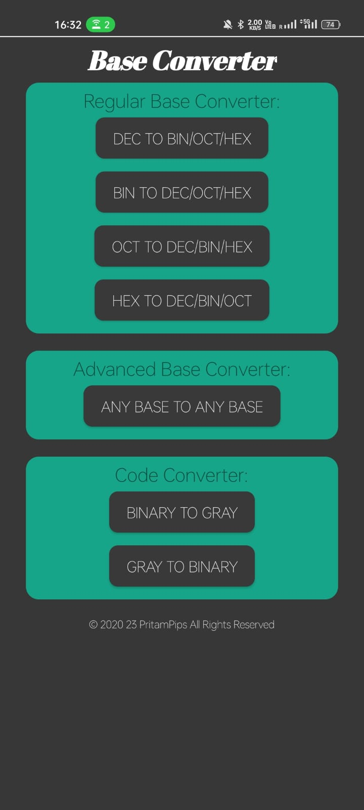
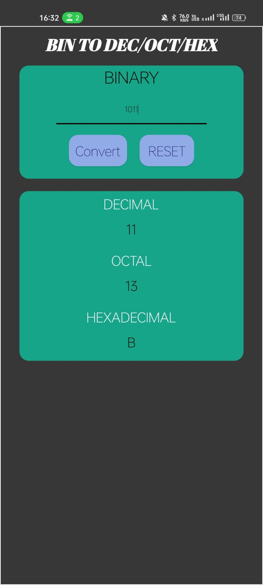
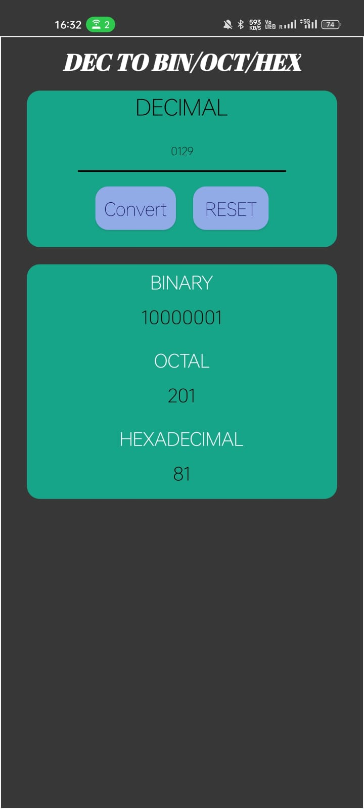
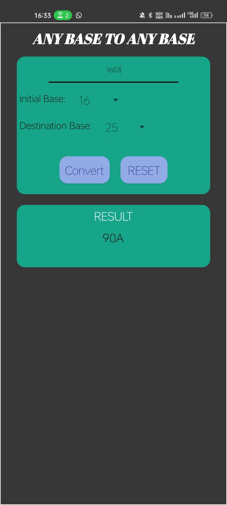
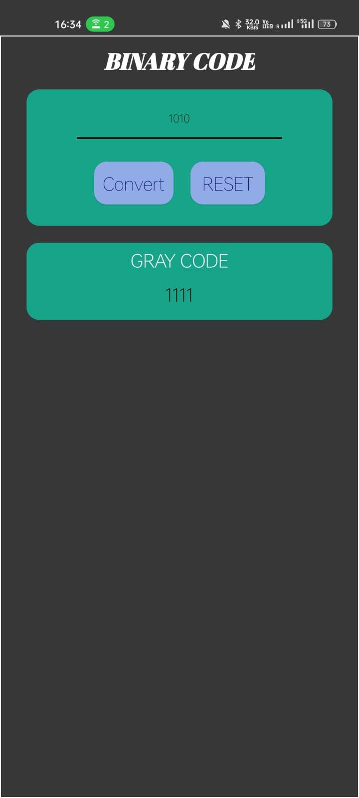

# AllBaseConverter
Any Base To Any Base Converter (No Ads):
Base converter for all base from base 2 to base 36. Convert Decimal Number to other basic bases, Binary Number to other basic bases, Octal Number to other basic bases and Hexadecimal Number to other basic bases using this. A very simple and clean layout without any ads. It can convert numbers with decimal point from any base to any base. Decimal, Binary, Octal and Hexadecimal converter.

# Screenshot of the App

## Author
* Pritam Mondal 
    * Email <pritammondalpips@gmail.com>
    * Github [@pipspritam](https://github.com/pipspritam "pipspritam profile")
    * Instagram [@pritam_pips](https://www.instagram.com/pritam_pips "Pritam's instagram")
    
    
## Google Play
Total download till February 2023 <h3> 500+ </h3> 
Link - [Play Store Link](https://play.google.com/store/apps/details?id=com.base_converter.base_converter&hl=en_IN&fbclid=IwAR1QtMQeqENJY7Pg1MU236CvIHATSeAY4hqNaFg5Y2CFCX2BvaPhWFfsGhc)
